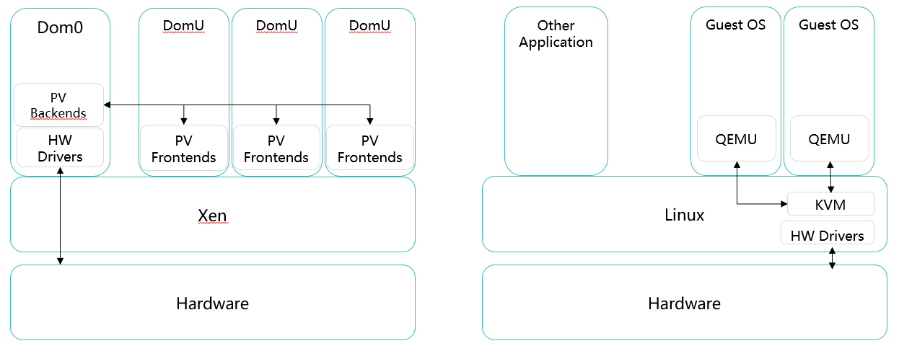
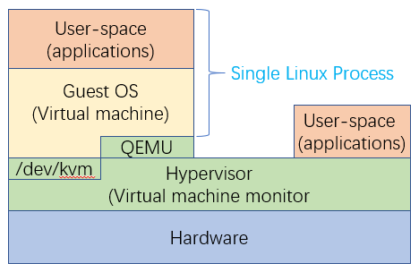

# KVM

如果说前两个小节还只是聊通用的技术，那么KVM就是一个具体的产品。虚拟化技术分为计算虚拟化、存储虚拟化、网络虚拟化，到目前为止还仅仅只是学习计算虚拟化，计算虚拟化下又划分CPU虚拟化、内存虚拟化、I/O虚拟化三个分支，虚拟化的实现一定要在硬件设备上安装虚拟化OS，主流的计算虚拟化技术中开源的虚拟化软件包含KVM、Xen，闭源的虚拟化软件包含Hyper-v、VMware ESXi、FusionSphere

## Xen与KVM

- **Xen**

    Xen架构是典型的Ⅰ型虚拟化，在上一小节的计算虚拟化的I/O虚拟化中有提及，I/O虚拟化下的半虚拟化架构就是取自Xen架构，`Dom0`就是系统VM，`DomU`代表用户VM

- **KVM（Kernel-based Virtual Machine）**

    KVM（Kernel-based Virtual Machine）是一个开源的全虚拟化解决方案，适用于x86硬件上的Linux，依赖CPU虚拟化技术的扩展（Intel VT或AMD-V）。它由一个可加载的内核模块`kvm.ko`和一个处理器专用模块`kvm-intel.ko`或`kvm-amd.ko`组成，前者提供核心虚拟化基础设施。随着虚拟化技术的发展，KVM现在也支持ARM、PowerPC等CPU

    由于依赖x86硬件支持（Intel VT-x或AMD-V），因此KVM被定义为硬件辅助的全虚拟化解决方案。同时，KVM基于Linux内核实现，KVM本身只是Linux内核的一个模块，可以视作一个应用程序，但KVM模块安装好后处于内核态，可以直接调用硬件，也就是说KVM能够直接将Linux转变为Hypervisor，这也是KVM与Ⅱ型虚拟化最大的不同

    回顾Ⅰ型和Ⅱ型虚拟化的特点，Ⅱ型虚拟化架构是在HostOS上安装虚拟化软件（VMM），整个VMM都处于用户态，而Ⅰ型虚拟化架构中VMM处于内核态，且可以直接调用硬件。综上，**KVM同时具备Ⅰ型和Ⅱ型虚拟化的特点**，华为的官方文档中将KVM列入Ⅱ型虚拟化。KVM在Linux内核中的模块就是`kvm.ko`，它**只用于管理vCPU和内存**，内核模块安装位置在`/dev/kvm`，`/dev/kvm`实际上是KVM提供的虚拟字符设备，当KVM收到VM发送的I/O指令时，通过此设备将I/O指令发送给QEMU

    相较Xen，KVM是非常精简的，所以KVM只负责CPU和内存的虚拟化，但VM所需要的资源远不止CPU和内存，还需要虚拟的I/O外设资源，所以还需要QEMU实现对I/O设备的虚拟化。KVM的用户空间组件包含在主线QEMU中，因此大多数文档中描述qemu-kvm，部分Linux虚拟机的直接命名也是qemu-kvm。QEMU自身是一个通用的开源的硬件模拟器，可用于模拟多种硬件。对于KVM而言，它只是一个Linux内核模块，并没有用户空间的管理工具，因此KVM借助QEMU的用户空间管理工具来管理虚拟机，QEMU也能够借助KVM加速、提升虚拟机的性能

    使用KVM，用户可以运行多个运行未经修改的Linux或Windows镜像的虚拟机。每个虚拟机都有专用的虚拟化硬件：网卡、磁盘、图形适配器等。从2.6.20开始（于2007年2月发布），KVM的内核组件包含在主线Linux中。从1.3开始，KVM的用户空间组件包含在主线QEMU中

## KVM体系架构

KVM作为内核中的一个模块，主要功能是初始化CPU硬件，打开虚拟化模式，以支持虚拟机的运行。以Intel的CPU为例，在KVM模块被内核加载后，CPU会初始化内部数据结构，检查系统CPU是否支持硬件辅助的虚拟化，打开CPU控制寄存器CR4中的虚拟化模式开关，并通过执行VMXON指令将宿主操作系统置于（包括KVM本身）虚拟化模式的Root Mode，最后KVM模块会创建一个特殊设备文件`/dev/kvm`并等待来自用户空间的命令。接下来虚拟机的创建和运行将是由一系列QEMU和KVM模块相互配合操作的结果

KVM负责CPU、内存的虚拟化，还有一些对性能要求比较高的设备，例如中断控制器、时钟也是由KVM控制，其他的I/O设备交由QEMU负责

### QEMU

QEMU自身是一个独立的、通用的、开源的硬件模拟器，它可以用于模拟多种硬件，但由于是全软件模拟，CPU参与模拟过多导致模拟效率低。在KVM架构中，**QEMU运行在用户空间**，用于提供I/O设备的虚拟化和用户空间的管理工具，借助KVM加速、提升虚拟机的性能。QEMU与KVM整合后，通过ioctl调用KVM创建的接口`/dev/kvm`进行通信，将CPU指令部分交由KVM，并向虚拟机提供模拟的I/O设备，例如用户空间通过QEMU模拟网卡、显卡、存储控制器和硬盘等设备。大多数文档中将QEMU与KVM整合后的软件包描述为qemu-kvm（qemu-system-XXX）

在KVM虚拟化场景中，VM的指令集到达KVM后，KVM将直接调用硬件处理CPU和内存的指令集，但由于无法处理I/O指令，KVM会将VM的I/O指令拦截并重定向到`/dev/kvm`，再由`/dev/kvm`设备将I/O指令发送给QEMU处理，QEMU再通过调用Linux系统驱动来实现调用物理硬件的I/O设备。I/O指令从VM到KVM，再从KVM到QEMU，QEMU调用Linux驱动。这其中多次经过内核态和用户态之间的切换

从某种意义上来讲，Ⅰ型虚拟化使用的VMM是一个特殊的、为虚拟化而做优化裁剪的系统，它会完成系统初始化、物理资源的管理、虚拟机的管理等功能，部分时候VMM会提供一个特殊权限的虚拟机，由该特殊虚拟机提供用户日常需要的管理、控制等一些操作环境，例如VMware ESXI的VMware Kernel、Xen的Domain 0

KVM属于Ⅱ型虚拟化，设备加电后会先运行Host OS，VMM作为一个特殊的应用程序，可以当作Host OS的扩展，Ⅱ型虚拟化下VMM通常不需要自身实现对物理资源的管理和一些复杂的算法，而是由Host OS来实现，KVM能够充分利用Linux操作系统的功能

### Libvirt

qemu-kvm提供的命令行的管理工具有大量的参数，不便于使用，因此现在通常会使用Libvirt的解决方案实现对虚拟化的管理，它提供统一的API、守护进程libvirtd和一个默认命令行管理工具virsh。Libvirt是目前使用最广泛的Hypervisor的管理解决方案，**也处于用户态**，可以将其看作是管理工具与虚拟化平台之间的一个中间件，在Libvirt上安装相应的驱动后，可以实现通过Libvirt对多种Hypervisor的管理

对于KVM而言，Libvirt提供与多种Hypervisor对接的API的库、以及多种语言的应用程序接口，例如C、python、java等，开发可以通过Libvirt提供的库函数自研针对不同Hypervisor的管理软件，管理工具也是通过Libvirt实现对VM的管控。除此以外，Libvirt还提供了一个libvirtd守护程序、一些命令行工具，有很多云计算的解决方案里对于Hypervisor的管理都是通过Libvirt实现的，例如OpenStack

KVM架构下，Libvirt调用qemu-kvm管理VM，QEMU和libvirtd均通过伪字符设备`/dev/kvm`触发内核模块。对于KVM而言，一台虚拟机就是一个普通的Linux进程，通过对该进程的管理就能够完成对虚拟机的管理

## KVM I/O操作流程

谈及KVM的I/O操作流程，就代表着肯定会谈到KVM+QEMU，通过上文的描述，此时需要对KVM、QEMU各自处于哪一层、各自负责实现什么功能有初步的认知。对下面的流程图中，假设有一台qemu-kvm虚拟机，在下面的探讨中先忽略CPU和内存，仅针对I/O调用关系进行讨论，既然是I/O调用，那么VM的I/O指令就一定会走到QEMU

### 一、默认流程（I/O全虚）

无论是使用虚拟硬件资源或物理硬件资源，Guest OS中都同样应该具备设备驱动，在默认I/O流程示意图中很明显不是采用硬件辅助虚拟化，因为I/O指令没有直接通到硬件，同时Guest OS的设备驱动又未区分为前驱和后驱，因此默认I/O操作流程图中使用的是全虚解决方案

1. Guest OS通过设备驱动调用虚拟硬件设备
2. Linux内核的KVM模块（I/O Trap Code）收到并捕获VM的I/O指令
3. KVM模块将VM的I/O指令转发到I/O共享页
4. QEMU仿真的虚拟硬件通过I/O共享页获取到VM的I/O指令
5. QEMU调用Linux系统驱动
6. Linux系统驱动调用物理硬件设备

在内存虚拟化小节中曾提及，物理内存之际上是以内存页的形式存在，I/O共享页实际上指的就是一部分物理内存页，只不过这部分物理内存空间被QEMU和KVM共享，用于存放qemu-kvm虚拟机的I/O指令和数据

KVM的默认I/O流程本身就是次优路径，虚拟机的每一次I/O指令都会经过内核态和用户态之间的切换，一旦qemu-kvm虚拟机的数量和每个虚拟机的I/O请求访问量增大，频繁的上下文切换就会导致性能降低

### 二、Virtio（半虚）

在Virtio半虚拟化场景下，Guest OS的驱动程序被一分为二，前端驱动安装在Guest OS中，后端驱动程序安装在QEMU中，环形队列Vring利用前驱、后驱模型，实现了VM与QEMU的直接互联，减少KVM内核在中间的参与，I/O数据不需要频繁的在内核态和用户态之间切换，改进了QEMU与VM之间的I/O吞吐

1. Guest OS通过前驱调用虚拟硬件设备
2. Virtio前驱会将VM的I/O指令写入Vring队列
3. QEMU中的Virtio后驱从Vring队列中读取VM的I/O指令
4. QEMU调用Linux系统驱动
5. Linux系统驱动调用物理硬件设备

Vring是一个环形消息队列，其本质就是内存空间中的一种数据结构，前驱将I/O指令写入Vring队列、后驱从Vring队列读取I/O指令，反之亦然。*Notification表示通知机制，环形队列无论是收到前驱或后驱的I/O数据后，都要通知另一方读取数据*，利用前后驱模型将VM与QEMU直接连接，减少KVM内核在中间的参与

Virtio与默认的I/O流程差别就在于，Virtio改进了虚拟机与QEMU之间的通信

> **补充**
>
> Virtio从官方材料了解，半虚拟化是需要修改操作系统内核的，windows作为一个闭源的操作系统无法修改内核。但是可以为windows安装半虚拟化的驱动程序，实现windows也能使用Virtio的前驱+后驱模型

## FusionCompute

- **VRM（Virtual Resource Manager）**

    VRM（虚拟资源管理器）对应的是CNA的管理端，可单独安装或作为VM安装，通过IP协议纳管CNA节点，为管理员提供一个`WebUI`作为统一入口`portal`，实现对VRM所纳管的CNA上面所有虚拟资源的生命周期的管理。VRM为CNA提供唯一的管理入口，没有VRM无法对CNA做操作，但VRM并不影响CNA上的业务。为了避免单点故障，VRM的部署一般采用主备模式，主备之间通过心跳检测运行状态，共享GaussDB和同一个浮动IP，所以主备至少需要3个IP。VRM主节点故障时，备节点成为新的VRM主节点，因为数据库是同一个，因此数据不会丢失

- **CNA（Compute Node Agent）**

    CNA（计算节点代理）对应的是虚拟化的服务器，KVM和用户的VM业务都在CNA上，业务VM使用的资源都是由CNA提供的计算、存储、网络资源。每一个节点都应该归属为某一个集群下，单VRM对其支持的最大主机数量、最大集群数量都是有限制的。CNA没有为管理员提供`web portal`，只能通过VRM管理CNA的虚拟化特性，通过链路捆绑保证CNA与VRM之间的管理平面的线路可靠性，CNA之间的VM迁移、备份、心跳检测也是走的管理网络

FusionCompute的两个组件VRM、CNA之间的关系类似于VMware的vCenter、ESXi的关系，ESXi作为实际的业务VM节点，通过vCenter对多个ESXi节点进行管理

### FusionCompute安装

以FusionCompute 8.0.0镜像为示例通过VMware Workstation安装

**CNA节点安装**

1. [Install] -> [Hard Drive] ->[Edit] -> [Choose the disk to install] -> [Format all partitions] -> [OK] -> [Yes] -> [Yes]；安装CNA节点并配置磁盘

        

    生产环境下建议所有CNA节点至少使用两块磁盘组成`RAID 1`，然后在`RAID 1`上安装CNA操作系统。此处实验环境中仅使用了一块500G磁盘，CNA安装要求swap空间要求至少为30G，因此虚拟磁盘空间要预留充足，实验环境下不做`RAID 1`

2. [Network] -> [Edit] -> [IPv4] -> [eth0] -> [Edit]

        

    此前描述FusionCompute的标准规划应该具备三个网络平面，此处安装CNA操作系统时，无论CNA上检测出有多少个网口，都应该只选择其中一个网口进行配置，此时配置的是CNA的管理网络，因此此时无论选中哪个网口，该网口都应该用于CNA与VRM之间的互联，此时配置的IP也应该是管理网络的IP段

3.  [配置IP信息] -> [OK] -> [OK] -> [OK]；配置完IP信息并保存、退回主安装界面时，此时已经能看到配置好的IP信息了

    

    配置IP时CNA提供了四个选项，从上到下分别表示“无IP配置”、“DHCP自动获取”、“手动配置IP地址”、“手动配置IP地址和VLAN号”，其中第四个选项意味着服务器与交换机之间互联的端口处于Trunk主干链路，具体细节此处不做过多赘述。实验环境中手动配置IP或DHCP自动获取都可

4. [Hostname] -> [配置主机名] -> [OK]

    

5. [Password] -> [Edit] -> [配置密码] -> [OK] -> [OK] -> [Yes] -> [Yes]；密码配置完成后确认整体配置无误后开始安装CNA操作系统

      

安装选项中带`*`号的选项是必选项，必须手动调整，其他参数可以使用默认参数。上例以CNA节点的安装作为示例，VRM节点的安装过程与CNA节点安装过程基本一致