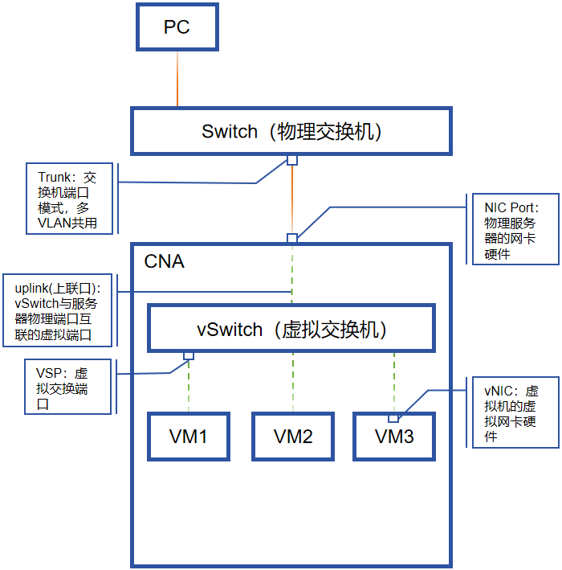

# 传统网络

*云计算课程的传统网络部分大多是讲授一些数通的基本概念和配置，建议直接学习数通的HCIA课程会更加通透，以下笔录中记录的内容仍以云计算概念为主，数通笔录另做记录*

## 虚拟化中的网络架构

包括VRM、CNA、存储设备在内的整个FusionCompute虚拟化集群环境的标准架构规划应该包含三个网络：*管理网络、业务网络、存储网络*。VRM与CNA物理节点之间互联的链路应该处于管理网络，两个组件之间通过管理交换机互联，管理网络上的流量应该仅限于CNA物理节点与VRM之间的运维的数据，例如日志告警、VRM向CNA下发的配置信息等

CNA节点上的VM用于运行真正的业务，业务面向互联网用户，因此VM的流量应该处于业务网络，VM上的业务最终还是需要通过物理硬件设备对外提供服务，此时CNA节点就需要至少两个网口分别接入管理网络和业务网络。普遍的场景下，VM不仅对互联网用户提供服务，不同的VM之间本身也会有通信需求，此时就需要考虑到相同CNA节点上的不同VM之间、不同CNA节点上的不同VM之间应该如何实现互相通信

因此，在CNA节点的内部会产生一个虚拟交换机（vSwitch），vSwitch负责同一个CNA节点上不同VM之间的网络连通、以及将VM的网络接入到物理网络中。vSwitch本身已经能够实现同一个CNA节点内部的VM之间的通信，但考虑到不同CNA节点之间的VM通信，还需要将CNA节点上的一个物理网口接入vSwitch，以实现VM与物理网络之间的通信。从VM到物理网络要经过两层交换机，分别是CNA节点内部的vSwitch和CNA节点的物理业务网络交换机

VM的流量不会通过CNA节点的管理网口出现在管理网络上，每一台CNA节点上都有一个VNA（Virtual Node Agent）代理，VNA与VRM对应，专用于VRM对CNA的管理，CNA也通过VNA向VRM上报自身设备运行状态，因此VNA是给Host OS使用的

如果业务数据存储在CNA节点本地，一旦CNA节点宕机，在该CNA节点上的业务数据就无法被其他业务VM访问，因此所有的CNA节点都应该将业务数据写入到一个集中的、所有业务VM都能访问到的存储设备上，而不是存储在CNA节点的本地磁盘上，存储设备与CNA节点互联的网络就是存储网络，此时CNA节点就需要至少三个网口分别接入三个网络

### 虚拟化中的物理网络

vSwitch与物理服务器的网口相连的虚拟接口被称作**uplink（上联口）**，所有的VM都是通过uplink连接到物理网络，VM根据业务的不同也需要通过vlan隔离，这就需要在vSwitch上划分vlan。虚拟化保证了不同VM之间是隔离的，无论是计算资源或网络资源都需要隔离，在服务器内，不同的VM通过vSwitch的vlan隔离，出了vSwitch在上联线路上就需要靠pvid对VM的数据进行隔离。所以在多业务的场景下，CNA连接交换机的线路端口必须使用Trunk口

不同VM业务网段通过Trunk技术可以实现复用同一根物理链路隔离不同网段数据。uplink口可以是物理端口或逻辑端口（链路聚合），无论是哪种，uplink口都只能有一个。如果uplink口使用逻辑端口，那么其成员可以有多个物理端口

Trunk链路是多Vlan公用的，不同Vlan在Trunk线路上通信时会在以太网帧上加上pvid标识，但**有且仅有**一个Vlan在Trunk线路上通信时不带pvid号，这就是Vlan0。实际上，不带pvid的vlan*可以自由定义*，但只能够定义一个不带pvid的Vlan，默认不带pvid号的Vlan就是Vlan0

那么，带pvid和不带pvid有什么区别呢，一个数据包带有pvid，从vSwitch出去到达Switch时，Switch会查看这个数据包中的pvid，如果此pvid为Vlan10，且Switch也允许Vlan10通过自身接口，那Switch就会将此数据包放在Vlan10中泛洪。而不带pvid时，数据包到达Switch，Switch会查询自身端口定义的唯一一个可以不带pvid的Vlan号（默认是Vlan1），如果查出此Vlan号是Vlan1，那Swtich就会将此数据包在Vlan1中泛洪

vlan号的可取范围是0~4095，但0和4095都不可取，如果在CNA的vSwitch上为某一端口配置“vlan0”，表示未指定vlan号，则标识此端口的数据不打pvid。vlan0是只有在服务器的vSwitch上才有的概念，物理交换机上不可配置vlan0，Switch上不带vlan号的pvid默认是vlan1，也可指定其他vlan号

## 虚拟化网络

虚拟化网络主要是研究服务器内部的网络结构，虚拟化的服务器上一定是存在虚拟化平台的，通过虚拟化OS实现网络虚拟化，而网络虚拟化中最典型的一个概念就是虚拟交换机vSwitch，又称为软件交换机。vSwitch处于内核态，处于用户态的VM通过虚拟网卡vNIC与vSwitch互联，vSwitch上与VM互联的端口又称为VSP（Virtual Switch Port），通过VRM又可以实现将不同的VSP配置到不同的VLAN中。所以，由用户态将VM的用户数据推送到内核态，vSwitch做完交换后，将数据通过物理服务器的网卡将数据推送到物理网络

vSwitch是由虚拟化OS模拟出的一个没有实体的软件交换机，业界有非常多的vSwitch产品，不同的厂商对不同的虚拟化场景也有各自的vSwitch产品

- VMware：VSS是单机版的vSwitch、VDS集群版的vSwitch
- 华为：CE1800v商用版vSwitch、EVS（Elastic vSwitch，弹性虚拟交换机）是非商用版的vSwitch。CE1800v大多用在数据中心场景下配合SDN控制器使用，EVS用在云计算场景下，非商用指的是EVS自带在CNA中，无需单独购买
- 开源：OVS（Open Virtual Switch），作为业界最流行的开源vSwitch。OVS作为开源的软件交换机，支持SDN、openflow等丰富特性，OVS基于流表转发数据，同时也支持以太网转发，具备较好的移植性

华为的两款vSwitch产品都是基于OVS的内核进行优化、封装后推出的，虽然EVS作为华为推出的云计算虚拟交换机，但CNA中最常用的还是OVS，EVS只会在特定的配置场景下出现

### 分布式虚拟交换机

DVS（Distribution vSwitch）分布式交换机是跨服务器的**处于管理层的一台逻辑交换机**，FC架构中无法直接对CNA进行配置，只能通过VRM提供的portal实现对CNA的集中管控，OVS同样如此，在VRM或CNA上无法直接对OVS进行配置，只能通过DVS对OVS实现集中管控。管理员通过VRM提供的portal登录到FC的管理视图后，首先需要先创建一个DVS，然后将CNA加入到DVS，通过VRM配置DVS后，DVS会将配置推送到所有加入自身的CNA上的OVS上，以此实现对多个CNA上的OVS的集中管控

跟VRM与CNA之间的关系类似，DVS处于管理层，仅负责统一管理、配置OVS，OVS处于业务层，实际上是由OVS控制VM与物理网络之间的数据通信。在CNA上是看不到DVS的，实际的数据转发也不经过DVS

#### DVS的配置步骤

缺省情况下CNA节点配置中并没有分布式交换机的存在，VRM的web管理视图缺省情况下也没有分布式交换机，因此管理员登录VRM的portal后，首先要创建一个DVS，然后将CNA加入到DVS

1. [资源池] -> [选中集群] -> [CNA01] -> [分布式交换机]；检查CNA节点的分布式交换机配置，缺省情况下为空

    

2. [资源池] -> [网络] -> [创建分布式交换机] -> [基本信息] -> [名称] -> [交换机类型] -> [上行链路] -> [VLAN池]；创建业务网络的分布式交换机

    

3. [添加上行链路] -> [绑定网口]；上行链路既可以选择已存在的聚合网口，也可以通过[绑定网口]直接新建聚合网口进行绑定

    

    创建DVS时勾选[添加上行链路]，此指定的“uplink口”即是OVS通往物理网络的上联口，无论何时，“uplink口”都建议使用聚合网口，即便聚合网口下只有一个成员物理网卡。且需要注意的是，无论是下一步的`[添加VLAN池]`或`[添加上行链路]`所指定的网口，都是在配置“uplink口”。在创建管理网络的聚合网口时，需要为管理网络创建逻辑接口，因为要为服务器的管理网络配置IP，但在创建“uplink口”时，它仅作为虚拟交换机的上行链路使用，因此它可以直接二层转发而不需要IP，即不必为“uplink口”创建逻辑接口

4. [添加VLAN池] -> [添加] -> [配置VLAN ID范围]

    

5. 查看分布式交换机信息

    

    DVS之所谓被称为分布式交换机，是因为它被分布在多个物理节点上，在VRM管理Portal的`[网络]`子栏目下可以观察到每台DVS分别在哪些物理节点上，也能观察到该DVS的uplink口处于哪些VLAN ID下

创建分布式交换机时必须选择“交换机类型”，在VRM上创建分布式交换机时所选择的交换机类型，就直接决定了每个CNA节点上创建的交换机的类型，交换机类型的选择涉及到此前所提及到的OVS、EVS以及硬件辅助虚拟化的部分，FC的交换机类型提供了3个选项，其中OVS、EVS都是软件交换机

1. 普通模式：选择普通模式，意味着每台CNA节点上会使用OVS作为虚拟交换机，物理服务器仅需要提供普通网卡即可支持普通模式的交换机类型

2. SRIOV直通模式：网卡硬件直通的交换，物理服务器需要提供SRIOV网卡

3. 用户态交换模式：用户态交换模式，意味着每台CNA节点上会使用EVS作为虚拟交换机，物理服务器需要提供DPDK网卡；也可以将这种交换机模式理解为OVS+DPDK

#### 端口组

端口组是分布式虚拟交换机的虚拟端口的集合，基于上文虚拟化网络的概述，VM如果想与vSwitch相连就需要将自身的vNIC连接到vSwitch上的VSP，端口组就是某一台DVS上的多个VSP的集合。端口组的主要作用是简化了对VSP的操作配置，例如，VM的vNIC接入到vSwitch的VSP后，多个VM所对应的VSP的配置相同时（例如多个VSP都处于VLAN 100、都进行限速等），针对VSP而言，同样的配置可能要配置多次。如果此时创建一个PortGroup，并将VLAN、安全、端口限速等配置应用到PortGroup上，然后将VM连接到此PortGroup上，PortGroup的成员VSP也就继承了PortGroup的配置，VM自然也就应用了该PortGroup的配置

每个DVS都有独立的`上行链路组`、`端口组`、`VLAN池`，如果要配置端口组，需要先选中一个具体的DVS，针对该DVS进行端口组的配置

**配置DVS的端口组**

1. [网络] -> [Service_DVS] -> [端口组] -> [添加] -> [名称] -> [端口类型]；创建端口组

    

    创建端口组时必须指定该端口组的端口类型，端口类型分为*普通*和*中继*，普通表示端口组中只能指定一个vlan号，中继表示trunk端口，支持多VLAN。端口组可以配置高级特性，例如端口限速、IP与MAC绑定等，用于安全和调优

2. [网络连接] -> [VLAN]；为端口组配置VLAN ID，此处配置的VLAN ID号不能超过DVS的VLAN范围

    

3. [网络] -> [Service_DVS]；一个DVS下可以存在多个端口组配置，各个端口组之间可以存在近乎于相同的配置，例如，一个端口组限速、一个端口组不限速，除此以外所有配置相同的两个端口组可以同时存在

    

在DVS上创建一个端口组并绑定VLAN，等同于所有被此DVS纳管的CNA节点上的OVS都创建了一个VSP，并为该VSP指定了一个VLAN。端口组的具体应用跟VM息息相关，在创建VM的过程中需要选择VM的虚拟硬件资源配置，在虚拟硬件资源配置的子栏目下会存在网卡配置，网卡配置上即可调整该vNIC接入到哪个DVS，以及DVS下的哪个端口组。VM上多个vNIC可以分别接入不同的DVS和不同的端口组，已创建好的VM上也可以通过调整VM的网卡配置来切换DVS和端口组

#### 流量走向

从FC的网络架构看，两台物理主机上各自存在3个虚拟机，6个虚拟机都接入到同一个DVS中，理论上虚拟机之间通过DVS即可实现网络通信。然而，无论软件上实现了何种高级特性，最终都需要通过底层的物理设备来完成数据通信。例如，VM1与VM6都连接在同一个DVS上，并属于同一个VLAN下，理论上两者通过DVS即可实现通信，然而，VM1与VM6并不属于同一个物理主机，因此实际的数据通信需要VM1先连接到`Host Machine 1`的OVS，通过OVS的上行链路将数据传递到物理交换机，物理交换机再将数据转发到`Host Machine 2`，最后通过`Host Machine 2`的OVS将数据传递到VM6。这个过程中不仅存在DVS配置的限制，还存在物理交换机与物理主机之间的数据交互

再例如，VM2上存在两个vNIC，其中一个vNIC接入了DVS的端口组VLAN 300，VM2与VM3接入同一个DVS的同一个端口组，理论上VM2与VM3之间可以实现通信，实际上由于VM2与VM3都属于同一台物理服务器，两者又同属于OVS的同一个端口组下，因此VM2与VM3之间可以实现物理主机内的通信，无需跨物理网络

以下是物理主机与端口组之间的4种通信关联关系：

- 同一主机，同一端口组：DVS内部实现通信
- 同一主机，不同端口组：三层设备实现网关通信
- 不同主机，同一端口组：二层设备实现通信
- 不同主机，不同端口组：三层设备实现网关通信

为了做到VM之间的通信隔离，需要尽量保证DVS端和物理Switch端都处于不同的网络，有不同的vlan范围。实现DVS之间逻辑上隔离、物理Switch之间隔离

#### 安全组

安全组是保护VM的最后一道屏障。众所周知，GuestOS上本身可能会自带有软件的防火墙，例如Win10的防火墙、CentOS的Firewall、iptables等，GuestOS自带的防火墙是第一道安全屏障。作为第二道安全屏障，安全组作用在vNIC与vSwitch的通信链路上，安全组是在vNIC上绑定了一套安全过滤规则的集合。安全组主要用于限制由外到内的数据通信，即同一个安全组内的VM通信或VM发起由内向外的访问请求都是放行的，缺省情况下，向VM发起的由外向内的请求，以及不同安全组之间的VM都是无法通信的，由此可见安全组主要添加放行由外到内的规则，简单来说安全组就是一组ACL

安全组是由虚拟化OS为VM提供的一套安全过滤策略，与GuestOS本身无关。

1. [安全组] -> [添加安全组] -> [名称] -> [添加规则] -> [填写规则信息] -> [确定] -> [确定]；创建安全组

    

添加规则是无法限制的数据流向的，规则仅针对由外到内的数据做筛选放行

#### 链路聚合

注：整个链路聚合小节都是指通过VRM对CNA节点的配置，VRM本身的链路聚合似乎没有web上的配置，官方的产品指导手册上说明了VRM的两种安装方式，通过虚拟机安装的VRM似乎没有必要使用链路聚合技术，虚拟机本身的高级特性就足够保障VRM的高可用性，通过物理机安装的VRM节点若想使用链路聚合技术，则需要通过ssh连接到CLI调整配置文件

链路聚合技术在现网中的使用非常频繁，它将多个物理网口绑定到一起，面向内核表现为**一个网口**，用户态的数据通过内核态先交给了聚合网口，聚合网口再根据聚合配置的方案的不同调用物理成员。链路捆绑在大方向上分为两种方案：主备（active/inactive）、负载均衡。使用主备方案时，服务器侧端口捆绑，交换机侧端口可以不捆绑，但负载均衡方案，两侧都必须配置链路捆绑。配置链路捆绑时，所有处于同一个聚合链路下的物理网口成员都享有同样的端口配置

相比较物理网络的聚合接口，在FC的实操中新增了一个*逻辑接口*的概念，不使用链路聚合技术时，对**网口的配置**和**数据的转发**都由物理网口实现。使用链路聚合技术时，在FC上的逻辑网口将*网口的配置*和*数据的转发*分离，物理网口仅负责*数据的转发*，*网口的配置*放在逻辑网口上，再将逻辑网口与聚合网口绑定，聚合网口下可以有一或多个物理网口成员，换言之，物理网口在逻辑网口中以成员的方式表示。这样实现网口配置不受物理端口状态的影响

**配置CNA主机的聚合接口**

1. [资源池] -> [选中集群] -> [CNA01] -> [配置] -> [网络] -> [聚合网口]；查看CNA节点的缺省的聚合网口

    

    聚合网口Mgnt_\Aggr是默认创建的，在FC的实操中，聚合网口、逻辑网口、物理网口三者都有自己的名字，IP地址实际上是配置给逻辑网口，而逻辑网口与聚合网口绑定，聚合网口下又有一或多个物理网口成员。例如，通过ISO镜像文件安装CNA的过程中可以配置CNA的管理平面的IP，这个IP实际上是配置给了管理平面的逻辑接口Mgnt-0，并且该逻辑接口缺省情况下与聚合网口Mgnt_\Aggr绑定，即便在安装CNA的过程中仅配置了一个网卡，例如eth0，在VRM的管理页面中仍可以为聚合网口Mgnt_\Aggr添加更多的成员网卡

2. [资源池] -> [选中集群] -> [CNA01] -> [配置] -> [网络] -> [逻辑接口]；安装CNA节点的过程中配置的IP地址在逻辑接口上

    

3. [资源池] -> [选中集群] -> [CNA01] -> [配置] -> [网络] -> [物理网卡]；在现网环境中所有网卡的LLDP服务都应该开启，LLDP服务全称是逻辑链路发现协议，使能交换机和服务器之间相互发现

    

4. [资源池] -> [选中集群] -> [CNA01] -> [配置] -> [网络] -> [聚合网口] -> [选中Mgnt_Aggr] -> [物理网卡] -> [添加网口]；为CNA管理网络的聚合网口添加成员物理网卡

    

5. [资源池] -> [选中集群] -> [CNA01] -> [配置] -> [网络] -> [逻辑接口]；检查物理成员网卡是否添加成功，逻辑接口不会受成员物理网口数量变化的影响

    

6. [资源池] -> [选中集群] -> [CNA01] -> [配置] -> [网络] -> [聚合网口]-> [编辑] -> [名称] -> [绑定模式]；修改聚合网口的名称和链路聚合工作模式，链路聚合工作模式有多种细分，但总体上都是主备和负载两个大模式下的变种

    

> **补充：关于逻辑网口**
>
> 在物理网络设备上似乎没有逻辑网口这个概念，现网组网上基本上只有物理网口和聚合网口的概念，通过链路聚合技术实现链路的高可用

#### DVS小结

如上图所示，在FC的网络结构中可以同时定义多个DVS。实际的业务场景可能没有那么复杂，多个CNA节点之间通过一个DVS即可实现VM业务，创建多个DVS的场景可能是考虑到不同的DVS承担不同的业务，那么在CNA\_02上创建的VM即可通过vNIC的配置，来选择该VM接入哪个业务网络

如果定义了多个DVS，可能CNA\_01与CNA\_02使用DVS\_01、CNA\_02与CNA\_03使用DVS\_02，那么相对CNA\_02而言它就处在两个DVS上，又因为DVS只是处于管理平面上，实际在数据转发平面，CNA\_02上具备两个OVS交换机，因此在CNA\_02上创建VM时可以通过两个vNIC连接到两个不同的OVS，通过两个不同的OVS连接到物理网络

多个DVS之间是逻辑隔离的，由此可见OVS也是隔离的，那么至少在CNA\_02内部，不同DVS之间的VM无法实现通信。但如果在物理网络中又存在物理交换机之间互联，例如TOR1与TOR2存在物理链路互联，那么不同DVS的VM又能够通过物理网络实现通信，因此，在前期的业务规划时，如果要保障两个业务之间的网络隔离，那就需要保障vSwitch和物理交换机之间都要实现隔离，即端到端隔离。但如果只有一台物理交换机的场景下，又想要实现不同DVS之间的隔离，可以为不同的DVS配置不同的VLAN池，在VLAN的层面对VM进行隔离

DVS在FusionCompute的视角下，是横跨多台服务器的大逻辑交换机，理论上，连在同一个DVS上的同一个端口组下的多个VM之间可以直接通信，但实际的通信过程需要依赖底层的物理网络的分析

> **补充：聚合网口单成员物理网卡的意义**
>
> 就数据转发而言，单成员物理网卡的聚合网口与直接使用物理网口的效果是一样的，但聚合网口本身实现了网口配置与数据转发的分离，假设业务因为某些原因前期只能使用一个物理网卡，此时使用聚合网口和物理网卡的区别就在于，后期扩容时，由于聚合网口实现了配置与数据的分离，因此聚合网口只需要添加物理成员网卡即可，而物理网卡的扩容，则需要重现配置网卡，必然会导致业务的下线。因此聚合网口相较物理网卡具备较强的延展性