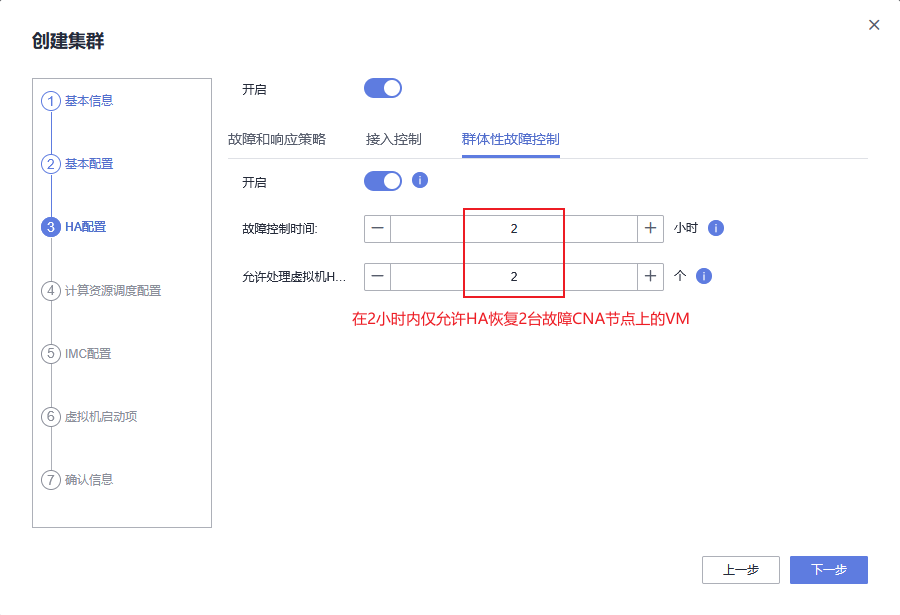

# 虚拟化集群特性

虚拟化带来的价值即使用资源的颗粒度更细、更灵活，虚拟化通过软件技术提取硬件基础设施的物理资源、功能，并切片整合为抽象的虚拟资源池，当有新增的虚拟机业务产生时，从资源池中抽取虚拟化资源分配给虚拟机，没有虚拟机业务产生时，虚拟化资源仍存放在资源池中等待调用，资源池的量越大，能支撑的虚拟机业务就越多。将物理资源转变为虚拟资源，虚拟资源具备物理资源所不具备的灵活性，虚拟资源能够被被随意组织、使用它带来的一些特性，物理资源仅需要提供相应的处理能力即可

然而，当应用程序对性能有高要求时，仍建议直接使用物理硬件资源。虚拟机对虚拟硬件资源的调用，实际上还是需要经过Hypervisor调度分配到物理硬件资源，看起来是虚拟机调用虚拟硬件资源，实际上最终还是需要调用物理硬件的能力，这个过程中还需要Hypervisor进行调用，在灵活性和特性上更加丰富，但性能上却不如直接使用物理硬件资源

## 集群特性

在华为FusionCompute虚拟化环境的组织结构中，缺省情况下资源池的顶层结构是`Site`，在`Site`下面可以创建集群文件夹、创建集群结构、直接添加CNA节点，多个集群结构可以存放在同一个集群文件夹中，集群文件夹作为集群结构的组织单元、集群结构本身也只是作为多个CNA节点的组织单元，因此无论是集群文件夹或集群结构都不是必须要创建的，VRM所管控的仍是CNA节点，因此`Site`下面可以直接接入CNA节点。然而，**华为针对虚拟化环境中启用虚拟化特性时，大部分时候是以集群为单位启用虚拟化特性的**，在同一个集群下的所有CNA节点能够享受到应用在集群上的虚拟化特性

一个集群能够将其下面的多个CNA节点组织起来，向外呈现更大当量的逻辑主机的计算能力。所有放在同一个集群下的主机共享应用到集群上的特性，集群也借助主机成员的能力向外提供服务。在组建一个集群时，建议集群下的所有成员要使用相同的资源、相同的配置、相同的架构和规格，例如使用相同的共享存储、使用同一个DVS（二层、大二层）通信，且同一个集群内的所有成员主机应尽量承担一样的业务，这样集群内的虚拟机在迁移或某些虚拟化特性失败的情况

与集群不一样的是，集群文件夹本身不具备任何特性，似乎集群文件夹的存在只是为了让管理集群结构变得更优雅

### 内存复用

业界的内存虚拟化技术的实现都离不开以下三种技术，可能还有更多的技术用于实现内存虚拟化，但无论是基于哪种技术实现的内存虚拟化，最终的目的都是为了实现让有限的物理内存，通过内存虚拟化特性得到更多的可用内存


如图，通过内存复用技术可以实现，在物理内存只有4G空间的情况下，实现3台虚拟机的内存总和为6G。内存复用技术实际上就是一种变相的超分配，使表面上看起来可用的内存超过实际的内存容量

1. 内存共享

   三个虚拟机都希望自己有独享的2G内存可以用于读写操作，由Hypervisor向每个虚拟机提供配备给虚拟机的2G内存，但物理内存只有4G，因此需要通过Hypervisor来提高物理内存的利用率，使Hypervisor表面上看起来能够提供6G内存

   当物理内存资源不足时，Hypervisor会将多个VM中相同的内存区域指向物理内存的某一内存页，Hypervisor将此内存页向上提供为共享内存，以此做到**超分配**。共享的内存页必须是**只读**的，如果要写，会在物理内存中新开辟一块空间执行写操作

   华为的内存共享技术所提供的共享内存，都是所有虚拟机中未使用到的内存空间。例如，假设三个VM上各自实际在运行的内存空间都只占用了1G内存，那么三个虚拟机另一半未占用的1G空间会被Hypervisor映射到物理内存的某一内存页

2. 内存气泡（别名内存气球）

   无论是内存共享或内存气泡，实际上都是超分配，内存气泡本质上是提高内存的利用率。Hypervisor为每个VM分配的内存空间，一般在VM中都无法得到完全使用，例如分配给VM的2G内存空间实际仅使用了70%，Hypervisor会将每个VM中的剩余的30%的琐碎内存通过页表指针整合，对外呈现一片未使用的连续的逻辑内存，然后由Hypervisor将这部分逻辑内存再分配给新的虚拟机，这就是内存气泡机制

   实际上VM对自身的内存情况毫不知情，所有的调用都是Hypervisor调用硬件，如果VM再要使用气泡中的内存时，实际上是VM需要更多的内存了，此时VM会将请求发送给hypervisor，再由hypervisor调用其他的内存供VM使用

3. 内存置换

   内存置换是调用存储空间用于扩充内存空间。内存响应速度和存储响应速度是不一样的，其提供的服务质量也不一样，为了尽可能提高服务质量，Hypervisor会将内存中的冷数据放在存储空间中

实际的内存复用技术指综合运用此3种方案，可能某一时刻使用内存复用，或某一时刻同时使用内存共享、内存气泡，但无论以上哪种方案，VM对自身的内存调用都是无感知的，所有的操作都由Hypervisor执行，管理员也无法选择具体使用其中某一种方案，管理员所做的也只是勾选了内存复用技术选项

针对集群开启的内存复用特性，能够享受到内存复用特性的虚拟机必须是同一台CNA节点上的虚拟机，不可跨CNA节点享受到内存复用特性。例如，CNA_01节点上通过内存气泡技术提供了更高的虚拟机密度，但CNA_01节点上的VM无法获取到CNA_02节点上通过内存气泡技术提供的内存空间

### HA（High Availability）

HA直译为高可用，在如今的业务软件上能够经常看到不同厂家强调自家产品的可用性和可靠性，这两种特性从两个不同的维度描述了厂家的设计方案，其中高可用就是研究产品的可用性

#### 可用性与可靠性

可用性主要关注两个方面：业务的连续性和业务的中断时间。它最关心的是当业务发生故障/灾难时，如何能够尽可能确保业务不中断，因此如果存在一套冗余的业务网络，在当前业务网络故障时，冗余的业务网络能够在有限的时间内快速支撑业务的正常运转，那么这套系统就是具备足够的可用性的。从冗余的网络支撑业务的正常运转所耗费的时间越短，甚至于业务不产生中断，那么这套系统的可用性就越高，但同样成本也就越高

而可靠性会更关注细节的实现，可靠性主要站在预防故障的视角，通过冗余的设计，例如通过堆叠、集群等技术来提高业务系统的可靠性。可用性侧重于整体业务的宏观视角，可靠性更关注网络结构中的某个微观的组件部分，例如某条链路、某个设备等

#### HA特性

HA特性针对集群生效，VRM通过心跳监控着所有CNA节点的状态，它也知道每一台CNA节点上存在多少台、何种规模的VM，因此当一个集群中的某CNA节点因未知原因宕机时，首先故障的CNA节点会被VRM检测到，其次VRM能够根据宕机的CNA节点上的VM规模在集群内的其他多个CNA节点上均衡的分布、重启业务VM，重启后的业务VM仅需重连后端存储即可恢复业务。HA能够实现快速的故障重启，但出于成本的考虑，大多数情况下业务会中断，用户也有感知，HA的价值在于它能够比管理员更快的发现、处理业务VM的故障，在集群内发生的故障，集群自身具备一定的“自愈”能力，免除了管理员的手动干预

针对集群的HA特性实际上也就是实现了该集群下的CNA节点的HA，除了CNA节点的HA，也有VM的HA，针对VM的HA只考虑Windows的蓝屏故障这一种场景，其它VM场景不支持。要实现针对VM的HA必须在GuestOS上安装**Tools**工具，此工具由虚拟化软件提供，Tools中包括配合Hypervisor工作的**监控**软件和**驱动**软件。一般情况下，Hypervisor只能监控计算节点的状态，而无法监控到计算节点上的VM状态是否健康，以VRM与CNA为例，正常情况下，当某个CNA节点上的VM出现异常时，是VM上的GuestOS出现异常，不会影响VM所在的CNA节点本身的状态，VRM缺省情况下仅管理CNA节点，CNA节点状态正常，则VRM不会对该CNA节点、以及该CNA节点之上的VM做任何操作

为了实现Hypervisor能够细化到可以监控VM的状态、以及直接对VM执行某些操作，需要尽早的在GuestOS中安装好Hypervisor提供的Tools。无论虚拟化环境中是使用的哪个厂商的Hypervisor，Hypervisor上都一定提供了对应的Tools，该Tools用于安装在VM中，Hypervisor通过Tools在GuestOS中植入了配合虚拟化特性和功能的一些插件，便于Hypervisor对VM的控制力度、控制深度能够深入到GuestOS上。以VM的重启操作为例，重启指令本身是GuestOS的指令，因此重启指令必须是进入GuestOS之后发起，在GuestOS上安装Tools后，等同于是在GuestOS上安装了一个VRM的Agent，通过VRM向VM发起重启操作时，VRM的指令会先发送到CNA的Hypervisor上，再通过Agent向GuestOS发起重启指令。如果直接在Hypervisor上对没有安装Tools的VM执行重启操作，会提示报错

当Windows蓝屏时，VRM可以通过Agent获取到VM的启动状态，此时就可以通过VRM来决定是否对VM开启HA特性，VRM检测到VM蓝屏时可以选择三种处理方式：重启、关机、在其他CNA节点上重启启动一台相同规模的VM

#### HA配置

1. [Site] -> [创建集群] -> [基本信息]；创建一个集群结构

   

2. [基本配置]；配置集群策略

   

3. [HA配置] -> [故障和响应策略]；

   

   故障和响应策略上包含三大策略配置：主机故障处理策略、主机数据存储故障处理策略、虚拟机故障处理策略，每个策略下又包含多个选项，不同选项实现不同的集群特性功能

   - 主机HA故障处理策略；即CNA节点故障后的策略动作
     - 原主机恢复虚拟机：等待故障CNA节点恢复，故障CNA节点恢复之前，该CNA节点上的VM也不会在集群内的其他CNA节点上启动
     - HA虚拟机：将故障CNA节点上的VM负载均衡到集群内的其他CNA节点上进行启动
   - 主机数据存储故障策略；主机数据存储故障指的是该CNA节点无法正常连接到SAN存储，即该CNA的数据存储故障，不是指SAN存储设备故障
     - 不处理：CNA节点无法正常连接到SAN存储时，不对CNA节点做任何动作，等待CNA节点恢复连接状态
     - HA虚拟机：CNA节点无法正常连接到SAN存储时，将该CNA节点上的VM，在集群内其他能够正常连接到SAN网络的CNA节点上重新启动
   - 虚拟机HA故障处理策略；虚拟机的GuestOS上必须要先安装有Tools之后，才能实现HA故障处理策略
     - 不处理：不对VM做任何动作
     - 重启虚拟机：在原CNA节点上重启VM
     - HA虚拟机：在集群内的其他CNA节点上重新启动VM
     - 关闭虚拟机：关闭VM

4. [HA配置] -> [接入控制] -> [HA资源预留]；缺省不启用接入控制特性，HA资源预留特性决定是否在CNA节点上预留计算资源，用于HA恢复故障虚拟机

   

5. [HA配置] -> [接入控制] -> [集群允许主机故障设置]；集群内指定数量的CNA节点发生故障时，允许集群通过保留的资源量对故障CNA节点上的VM做故障恢复动作

   

6. [HA配置] -> [群体性故障控制]；缺省不启用群体性故障控制

   群体性故障控制需要在“主机相关故障和响应策略”开启时生效，通过配置“故障控制时间”内“允许处理虚拟机HA的主机数”，实现控制群体性故障时出现大规模的虚拟机HA。被群体性策略控制的主机，其上的虚拟机只能等待主机恢复后重启虚拟机。例如，2小时内连续故障了5个主机，缺省情况下的系统配置，只会对前2个主机上的虚拟机按“主机故障处理策略”和“虚拟机代替项“的配置进行HA，其他3个主机上的虚拟机就只能等待主机恢复后重启虚拟机

   

7. [计算资源调度配置]；使用缺省参数，暂时不做调整

   

8. [IMC配置]；使用缺省参数，暂时不做修改

   

9. [虚拟机启动项]；使用缺省参数，暂时不做修改

   

10. 要实现VM的HA，那么除了在创建集群时需要开启集群的HA特性以外，还需要对该集群下的指定VM开启HA特性，否则集群下的CNA节点故障时，缺省情况下对VM的的处理策略是不作为。该任务指导管理员在FusionCompute中，当集群开启HA配置或者计算资源调度时，通过设置虚拟机替代项，对单个或批量虚拟机设置异于集群的HA策略或计算资源调度策略

**虚拟机安装Tools**

[虚拟机] -> [操作] -> [Tools] -> [挂载Tools]；为虚拟机挂载Tools软件


### DRS（Dynamic Resource Scheduler）

动态资源调度。每个CNA节点都与VRM有管理平面通信，VRM记录各个CNA节点的资源调度情况以便于实现动态资源调度。*DRS*主要指代CNA节点中的**CPU和内存**的负载均衡，**DRS是集群特性，热迁移是DRS的先决条件**

**迁移**

迁移分为*热迁移*和*冷迁移*，*热迁移*下又分为**主机迁移**、**存储迁移**和**两者都迁移**。VM大致可以分为两种资源：**计算资源**、**存储资源**，*计算资源*在CNA节点上，表现为占用CNA节点的vCPU和vMEM。*主机迁移*表示VM所占用的*计算资源*从CNA1节点迁移到CNA2节点上运行。*存储迁移*表示VM存储文件在后端存储节点间迁移，*计算资源*不动

**热迁移（内存分片，迭代迁移）**

VM迁移之前，业务是连续的，执行热迁移时先将VM的内存冻结，保存当前VM内存数据的完整性，内存冻结后向外仅提供只读，但业务在持续进行数据访问，所以必须为此VM新开辟一个内存空间用于临时的业务数据写入，由VRM将首次冻结的内存复制到CNA2节点。内存复制完成后CNA1节点将开辟的临时内存空间做二次冻结并再次另开辟一个临时使用的内存空间，由VRM将二次冻结的内存数据复制到CNA2节点。重复此操作直到某个临界点，将VM在CNA1节点中的内存数据完全复制到CNA2节点上并在CNA2节点上运行VM，这整个过程GuestOS都无感知，由hypervisor执行迁移

```diff
- 使用热迁移必须保证CNA节点处于同一DVS下，且都使用同一共享存储
```

**DRS规则**

基于业务的视角可以对集群中的VM设置DRS规则组，规则组用于实现VM之间的**聚集**策略或**互斥**策略

- 聚集虚拟机：列出的VM必须在同一CNA上运行，一个VM只能加入一条聚集虚拟机规则中

- 互斥虚拟机：列出的VM必须在不同CNA上运行，一个VM只能加入一条聚集虚拟机规则中
- 虚拟机到主机：关联一个VM组和Host组并设置关联规则，指定所选VM组的成员是否能够在特定Host组的成员上运行


## DPM（Dynamic Power Managerment）

DPM基于DRS实现，DRS与DPM都是集群特性，是在CNA之间的热迁移的过程。DRS侧重于根据CNA的CPU、Mem的运行状态实现集群的负载均衡。DPM侧重于集群的**绿色省电**，不同时间段的业务的访问量不同会导致一些CNA节点的轻载，将轻载节点上的业务VM迁移到其他CNA节点使轻载节点变为空载节点，并对其执行下电操作，等到其他CNA节点处于重载运行时再将空载节点上电并执行DRS操作。这就是**轻载合并、空载下电、重载上电**，无论重载或轻载都有一个阈值，VRM通过阈值判断CNA节点处于重载或轻载

```diff
- DRS或DPM的自动迁移仅会在同一集群中迁移，手动迁移可实现跨集群迁移，但仍需要处于同一DVS和共享存储的情况下
- 要实现重载上电必须配置主机BMC参数，通过BMC端口实现CNA节点的上电
```


## NUMA（Non Uniform Memory Access）

**Host NUMA**

一般服务器设备中使用多路多核架构以提高设备的并发处理能力，不同CPU的位置不同与内存条的距离远近也不同。*NUMA*架构将内存条按照CPU的位置进行排列，使每个CPU可以就近的访问离自身最近的内存条，防止不同CPU访问距离较远的内存。每一颗CPU及其周边内存、总线叫做一个NUMA-node，每一个node都是逻辑的计算节点，理论上来说都能承担一个独立的计算作业，有自身独立的CPU和内存和连接其他CPU和内存的总线。硬件资源最终都是由OS调度使用，为了使node内的内存数据也由此node内的CPU处理，必须使OS感知物理架构。NUMA功能需要通过BIOS打开

**GuestOS NUMA**

VM中的应用向GuestOS发起作业，由于GuestOS对硬件架构无感知，GuestOS会将请求直接发送给hypervisor，这就有可能出现CPU处理远距离内存数据。为了避免此情况，需要hypervisor将硬件架构透传给GuestOS，使GuestOS感知NUMA，尽可能实现同一node下的CPU处理内存数据


## Tools

任何hypervisor都会为运行在其上的VM提供相应的*Tools*，*Tools*主要包括**内核态的硬件驱动**和**用户态的vm-agent进程**，*驱动*主要用于VM配合hypervisor完成虚拟化资源调配的操作，*agent*主要用于向VRM报告VM的运行状态


#### 小结

**基本特性**

- 内存复用
- NUMA

**HA**

- CNA主机故障
- 数据存储故障
- Windows蓝屏

**负载均衡**

- 集群资源调度
- 电源管理
- DRS规则

**IMC**

​	不同型号的CPU的指令集会有所不同，两个CNA节点的CPU指令集不同可能导致VM迁移失败，为了避免这种情况，所有CNA节点的CPU都是用低版本的指令集以达到向VM提供同样的指令集，这就是IMC策略，IMC策略使集群特性，且开启IMC特性时集群中不能存在VM

```diff
+ VNC登录：管理员通过浏览器耦合在http上的VNC协议访问到CNA主机，再通过hypervisor提供的API访问到VM，将VM的控制台复制到浏览器
```

## 创建集群

1. 

   

2. [HA配置]

3. [开启计算资源调度]；自动迁移特性

4. [开启IMC]


在创建集群时，集群下一台CNA节点都没有，而在创建集群的过程中就需要确认是否启用虚拟化特性，所以虚拟化特性实际上是针对集群生效的
